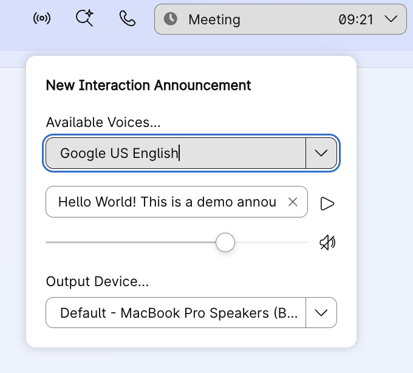
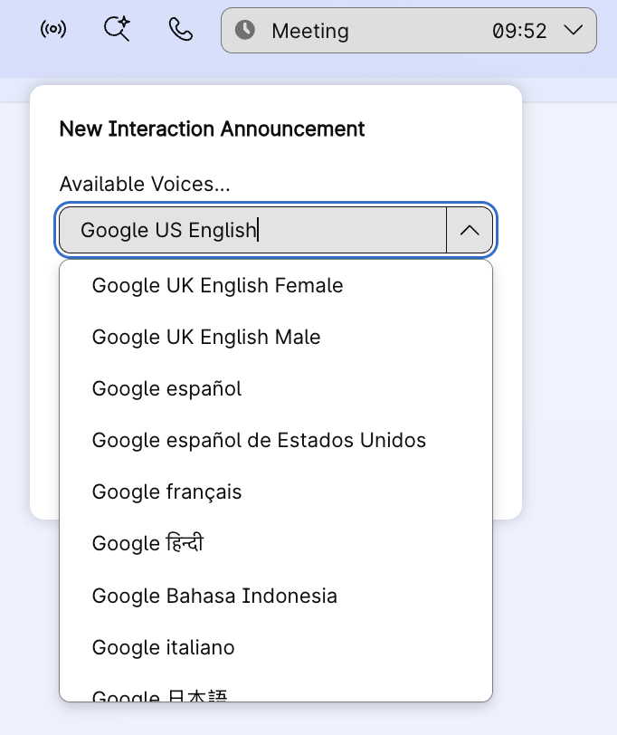

## Desktop Widget
## Text-to-Speech Announcements for Incoming Interactions

This widget uses Text-to-Speech (TTS) to announce incoming interactions by reading out contact details. Agents receive audio announcements for new calls, chats, emails, and social media interactions with customizable voices, volume, and field filtering.

The widget automatically announces interaction details when contacts are offered, helping agents prepare before accepting. Supports TTS voices in local language (subject to availability), custom output devices, and intelligent field filtering to announce only important information.

## Features

- **Text-to-Speech**: High Quality TTS announcements using browser's native Web Speech API
- **Volume control**: Individual volume sliders for each channel type
- **Mute functionality**: Quick mute/unmute buttons for each channel
- **Audio device selection**: Choose preferred audio output device (speakers, headphones, etc.) Dynamic device changes are reflected real time
- **Persistent preferences**: Settings are saved locally and restored on login
- **Test playback**: Preview selected sounds before receiving actual interactions
- **Smart field filtering**: Filtering out fields using `skipValuesFor` configuration in the layout
- **Custom pre-announcement text**: A short heads up before announcing important information

### Widget UI





## How It Works

**For Telephony Interactions:**
- Reads fields from the Desktop View pop-over configuration
- Filters out fields specified in `skipValuesFor`
- Announces: `"Hey! You have new incoming call... [Field] is [Value]. [Field] is [Value]..."`

**For Digital Interactions (Chat, Email, Social):**
- Reads all Call Associated Data fields
- Filters out fields specified in `skipValuesFor`
- Announces: `"Hey! You have new incoming [media type]! [DisplayName] is [Value]..."`

**Automatic Behavior:**
- Stops playback when interaction is assigned to agent
- Stops playback on RONA (Redirection On No Answer)
- Stops playback when interaction ends


## Try this widget from local env

How to run the widget:

**Step 1:**

_To use this widget, we can run it from localhost_

- Inside this project on your terminal type: `npm install`
- Then inside this project on your terminal type: `npm run dev`
- This should run the app on your localhost:3001

**Step 2:**

_Add the widget to desktop layout:_

- Sign in to Agent Desktop and access the widget via the header icon.
- Configure voice, volume, and test the TTS with custom text.
- Optionally update `skipValuesFor` in layout to filter specific fields.

_Manually update the agent team layout_

- Copy the below code to the `advancedHeader` section of desktop layout under `agent` and / or `supervisorAgent` profiles.
- Update the `script` URL to point to your hosted widget file.

**Basic Configuration:**
```json
{
  "comp": "desktop-agent-announcement",
  "script": "http://localhost:3001/build/desktop-agent-announcement.js",
  "attributes": {
    "darkmode": "$STORE.app.darkMode"
  }
}
```

**Advanced Configuration with Field Filtering and Announcement:**
```json
{
  "comp": "desktop-agent-announcement",
  "script": "http://localhost:3001/build/desktop-agent-announcement.js",
  "properties": {
    "skipValuesFor": ["ANI", "DNIS", "ani", "dn", "ronaTimeout"],
    "preAnnounce": "Attention! You have a new contact. "
  },
  "attributes": {
    "darkmode": "$STORE.app.darkMode"
  }
}
```

## Widget Properties

| Property | Type | Required | Default | Description |
|----------|------|----------|---------|-------------|
| `skipValuesFor` | Array | No | `[]` | Array of field names to exclude from announcements (e.g., `["ANI", "DNIS"]`) |
| `preAnnounce` | String | No | Custom String | Custom text to speak before reading interaction details |

## Default Settings

On first launch, the widget sets these defaults:

- **Voice**: Google US English
- **Volume**: 70%
- **Mute**: Unmuted
- **Demo Text**: "Hello World! This is a demo announcement."
- **Audio Device**: System default output

## Browser Compatibility

**Web Speech API Support:**
- Chrome/Edge: Full support with cloud voices (recommended)

**Note**: Cloud-based voices (recommended) are only available in Chrome/Edge. The widget filters to show only cloud voices (`localService === false`) for better quality.

**Audio Output Selection (`setSinkId()`):**
- Chrome/Edge
- Firefox (not supported)

## Improve the widget:

- You can modify the widget as required.
- To create a new compiled JS file, execute the command `npm run build` which will create the new compiled widget under `src/build/desktop-agent-announcement.js`.
- You may rename this file, host it on your server of choice, and use host link under `script` in the layout.

## Troubleshooting

**No Voices Available:**
- Ensure you're using Chrome or Edge for cloud-based voices

**Announcement Not Playing:**
- Check that widget is not muted
- Verify audio output device is connected and working
- Check browser console for errors
- Ensure interaction data includes the fields being announced

**Fields Not Being Announced:**
- Check `skipValuesFor` configuration - these fields are intentionally skipped
- Check browser console logs for the filtered values

## Useful Links - Supplemental Resources

[Desktop JS SDK Official Guide](https://developer.webex.com/webex-contact-center/docs/desktop)

[Create custom desktop layout](https://help.webex.com/en-us/article/ng08gqeb/Create-custom-desktop-layout)

[Desktop Widgets Live Demo](https://ciscodevnet.github.io/webex-contact-center-widget-starter/)

[Web Speech API Documentation](https://developer.mozilla.org/en-US/docs/Web/API/Web_Speech_API)

## Disclaimer

> This is a sample widget to demonstrate Text-to-Speech capabilities using the Desktop SDK and Web Speech API.
> This demo showcases the possibilities of Desktop SDK and helps to identify & implement use cases.
