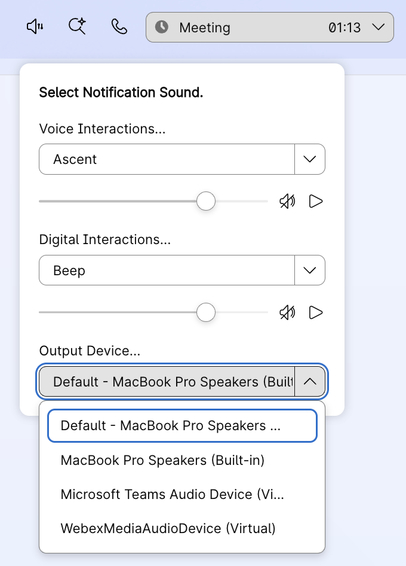

## Desktop Ring V2 Widget
## Customizable Notification Sounds for Voice and Digital Interactions

This widget provides agents with the ability to customize notification sounds for incoming interactions based on channel type (Voice/Telephony and Digital channels). Agents can select different ringtones, adjust volume levels, mute notifications, and choose their preferred audio output device - all from a convenient popup interface in the Agent Desktop header.

### Features:
- **Channel-specific ringtones**: Separate sound selections for Voice (Telephony) and Digital (Chat, Email, Social) interactions
- **Volume control**: Individual volume sliders for each channel type
- **Mute functionality**: Quick mute/unmute buttons for each channel
- **Audio device selection**: Choose preferred audio output device (speakers, headphones, etc.)
- **Persistent preferences**: Settings are saved locally and restored on login
- **Test playback**: Preview selected sounds before receiving actual interactions

### Widget UI



## Try this widget from local env

How to run the sample widget:

**Step 1:**

_To use this widget sample, we can run it from localhost_

- Inside this project on your terminal type: `npm install`
- Then inside this project on your terminal type: `npm run dev`
- This should run the app on your localhost:3001

**Step 2:**

_Add the widget to desktop from the shared layout:_

- Download or open your team's desktop layout JSON file
- Host your audio/ringtone files (.mp3 format) on an accessible server
- Note the URL path to your audio files directory
- Copy the widget configuration code below and add it to the `advancedHeader` section of your desktop layout under both `agent` and/or `supervisorAgent` profiles
- Update the `ringerUrl`, `voiceTones`, and `digitalTones` properties with your specific values
- Save the layout and upload & assign to the team via Control Hub or Admin Portal
- Note: Layouts are configured per Agent Team
- Sign in to Agent Desktop with the team assigned the above layout
- Click the audio icon in the header to configure notification sounds

_Widget configuration for desktop layout:_

```json
{
  "comp": "desktop-ring-v2",
  "script": "http://localhost:3001/build/desktop-ring-v2.js",
  "attributes": {
    "darkmode": "$STORE.app.darkMode"
  },
  "properties": {
    "ringerUrl": "https://your-server.com/path/to/ringtones/",
    "voiceTones": ["Ascent", "Calculation", "ClassicRinger", "Delight", "Evolve", "Mellow", "Mischief", "Playful", "Reflections", "Ripples", "Sunrise", "Vibes"],
    "digitalTones": ["Beep", "Bounce", "Calculation", "Cute", "Drop", "Evolve", "Idea", "Nimba", "Open", "Snap", "Tick", "Vibes"]
  }
}
```

### Property Configuration:

**Required Properties:**

- `ringerUrl` (string): The base URL path where your audio files are hosted. Must end with a trailing slash. Example: `"https://cdn.example.com/ringtones/"`
  - The widget will append the tone name + ".mp3" to this URL
  - Example: If ringerUrl is `"https://cdn.example.com/ringtones/"` and user selects "Evolve", it will play `"https://cdn.example.com/ringtones/Evolve.mp3"`

- `voiceTones` (array): List of available ringtone names for Voice/Telephony interactions. Example: `["ClassicRinger", "Evolve", "Mellow"]`
  - Each name must match the filename (without .mp3 extension) of an audio file on your server

- `digitalTones` (array): List of available ringtone names for Digital (Chat/Email/Social) interactions. Example: `["Beep", "Bounce", "Cute"]`
  - Each name must match the filename (without .mp3 extension) of an audio file on your server

**Audio File Requirements:**
- Format: MP3
- Naming: Must match the names in `voiceTones` and `digitalTones` arrays
- Location: All files must be accessible at the `ringerUrl` path
- Example structure:
  ```
  https://your-server.com/ringtones/
    ├── ClassicRinger.mp3
    ├── Evolve.mp3
    ├── Mellow.mp3
    ├── Beep.mp3
    ├── Bounce.mp3
    └── Cute.mp3
  ```

## Build the widget for hosting:

- You can modify the widget as required
- To create a new compiled JS file, execute the command `npm run build` which will create the compiled widget under `./src/build/desktop-ring-v2.js`
- You may rename this file, host it on your server of choice, and use the hosted link under `script` in the layout
- Update the `ringerUrl` property to point to your cloud hosting audio files location (AWS S3, Azure blob, ...)

## Widget Behavior:

- When an incoming Voice/Telephony interaction is offered, the widget plays the selected Voice ringtone
- When an incoming Digital interaction (Chat, Email, Social) is offered, the widget plays the selected Digital ringtone
- Ringtone automatically stops when:
  - Agent accepts the interaction
  - Interaction is RONA'd (Redirection on No Answer)
  - Interaction ends before answer (Abandoned interaction)
- Agent preferences (selected ringtones, volume levels, mute status, audio device) are saved in browser local storage
- Preferences persist across browser sessions and Desktop logins until browser cache is cleared

## Useful Links - Supplemental Resources

[Desktop JS SDK Official Guide](https://developer.webex.com/webex-contact-center/docs/desktop)

[Create custom desktop layout](https://help.webex.com/en-us/article/ng08gqeb/Create-custom-desktop-layout)

[Desktop Widgets Live Demo](https://ciscodevnet.github.io/webex-contact-center-widget-starter/)

## Disclaimer

> This is a sample widget demonstrating the capabilities of the Webex Contact Center Desktop SDK. While functional, it is meant as a POC and not production ready. Audio files and hosting infrastructure should be validated in your environment.
