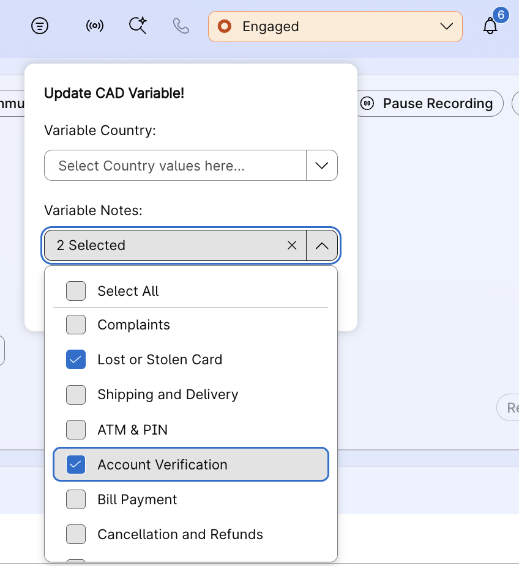
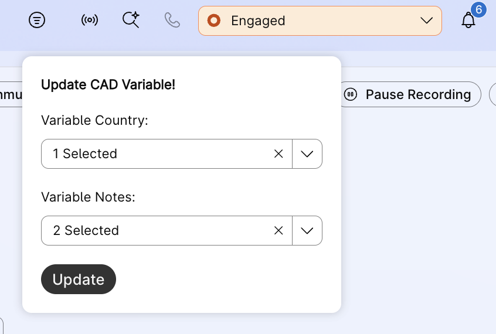

## Desktop Widget
## Multi-Select List type CAD variables / Nested Wrap Up codes for Active Interactions

This widget allows agents to multi-select CAD variables during active interactions. This also serves as a nested wrap up selector for completed interaction. The widget dynamically generates UI elements based on configured CAD variables, enabling agents to select and update multiple values with a single click.

Supports multi-select dropdown menus for each CAD variable, making it easy to update interaction metadata without leaving the Desktop interface. Perfect for wrap-up classification, tagging, or updating interaction attributes in real-time.

Use of Global Variables allows reporting on these multi-select, multi-list variables.

### Widget UI





## Features

- Dynamic UI generation based on layout configuration
- Multi-select list dropdown for each CAD variable
- Single-click update for all selected variables
- Supports multiple CAD variables simultaneously
- Auto-clears selections when interaction ends
- Visibility control based on interaction media type
- Select-all functionality for quick selections
- Shows selected count for each variable
- Dark mode support

## How It Works

The widget reads CAD variable configurations from the Desktop layout and dynamically creates a UI section for each variable. Agents can:

1. Select one or multiple values from dropdown menus
2. Click "Update" to push changes to the active interaction
3. Variables automatically clear when interaction ends
4. Widget visibility controlled by tasktype attribute (can be filtered by media type)

**Dynamic Configuration:**
- `cadVariable0`, `cadVariable1`, etc. - Names of CAD variables to update. These should be defined & reportable global variables created on Control Hub.
- `variableList0`, `variableList1`, etc. - Arrays of possible values for each variable

**Automatic Behavior:**
- Clears all selections when no active task
- Updates interaction via Desktop SDK `updateCadVariables` API
- Combines multiple selections with comma separation

## Try this widget from local env

How to run the widget:

**Step 1:**

_To use this widget, we can run it from localhost_

- Inside this project on your terminal type: `npm install`
- Then inside this project on your terminal type: `npm run dev`
- This should run the app on your localhost:3001

**Step 2:**

_Add the widget to desktop layout:_

- Sign in to Agent Desktop and access the widget via the header icon during active interactions.
- Select values from the dropdown menus for each CAD variable.
- Click "Update" to apply changes to the active interaction.

_Manually update the agent team layout_

- Copy the below code to the `area` section of desktop layout under `agent` and / or `supervisorAgent` profiles.
- Update the `script` URL to point to your hosted widget file.
- Configure `cadVariable` and `variableList` properties for your use case.

**Basic Configuration (One Variable):**
```json
{
  "comp": "desktop-update-variable",
  "properties": {
    "cadVariable0": "Category",
    "variableList0": ["Sales", "Support", "Billing", "Technical"]
  },
  "attributes": {
    "darkmode": "$STORE.app.darkMode",
    "taskid": "$STORE.agentContact.selectedTaskId",
    "tasktype": "$STORE.agentContact.isMediaTypeTelePhony"
  },
  "script": "http://localhost:3001/build/desktop-update-variable.js"
}
```

**Advanced Configuration (Multiple Variables):**
```json
{
  "comp": "desktop-update-variable",
  "script": "http://localhost:3001/build/desktop-update-variable.js",
  "properties": {
    "cadVariable0": "Department",
    "variableList0": ["Sales", "Support", "Billing", "Technical", "Management"],
    "cadVariable1": "Resolution",
    "variableList1": ["Resolved", "Escalated", "Pending", "Callback Required"],
    "cadVariable2": "Tags",
    "variableList2": ["VIP", "New Customer", "Returning", "At Risk", "Premium"]
  },
  "attributes": {
    "darkmode": "$STORE.app.darkMode",
    "taskid": "$STORE.agentContact.selectedTaskId",
    "tasktype": "$STORE.agentContact.isMediaTypeTelePhony"
  }
}
```

## Widget Properties & Attributes

| Property | Type | Required | Description |
|----------|------|----------|-------------|
| `cadVariable0`, `cadVariable1`, etc. | String | Yes | Name of the CAD variable to update (matches variable name in Webex CC) |
| `variableList0`, `variableList1`, etc. | Array | Yes | Array of possible values for the corresponding CAD variable |
| `taskid` | String | Auto | Interaction ID (passed by Desktop Store) |
| `tasktype` | String | Auto | Media type filter (passed by Desktop Store) |
| `darkmode` | String | Auto | Dark mode flag (passed by Desktop Store) |

**Note**: You can configure any number of CAD variables by incrementing the index (0, 1, 2, 3, etc.). Each `cadVariable{n}` must have a corresponding `variableList{n}`.

## Configuration Guidelines

**Variable Naming:**
- `cadVariable` names must match exactly with CAD variable names defined in Webex Contact Center
- Variable names are case-sensitive
- Use the exact variable name as shown in Control Hub

**Variable Lists:**
- Arrays can contain any number of values
- Values are displayed in the order they appear in the array
- Values support special characters and spaces
- Multi-select allows agents to choose multiple values (comma-separated in payload)

**Layout Attributes:**
- `taskid` - Automatically populated by Desktop with current interaction ID
- `tasktype` - Can be used to show/hide widget based on media type
- `darkmode` - Automatically synced with Desktop theme

## Improve the widget:

- You can modify the widget as required.
- To create a new compiled JS file, execute the command `npm run build` which will create the new compiled widget under `src/build/desktop-update-variable.js`.
- You may rename this file, host it on your server of choice, and use host link under `script` in the layout.

## Troubleshooting

**Widget Not Appearing:**
- Verify widget is added to the correct advancedHeader layout area
- Check that Desktop layout is assigned to the agent team
- Ensure widget script URL is accessible

**Update Not Working:**
- Verify CAD variable names match exactly in Control Hub
- Check browser console for API errors
- Verify interaction is active

**Variables Not Showing:**
- Check that `cadVariable{n}` and `variableList{n}` pairs are configured correctly
- Verify JSON syntax in layout configuration
- Check browser console for property identification errors

**Values Not Clearing:**
- Widget automatically clears when `taskid` becomes null/undefined
- Ensure Desktop layout is passing taskid attribute correctly
- Check for any JavaScript errors in browser console

## Use Cases

- **Interaction Classification**: Tag interactions with categories (Sales, Support, etc.)
- **Priority Setting**: Mark interaction priority or urgency level
- **Wrap-up Codes**: Update disposition or resolution status
- **Customer Tagging**: Add customer attributes (VIP, New, Premium, etc.)
- **Issue Tracking**: Classify issue types and sub-categories

## Useful Links - Supplemental Resources

[Desktop JS SDK Official Guide](https://developer.webex.com/webex-contact-center/docs/desktop)

[Create custom desktop layout](https://help.webex.com/en-us/article/ng08gqeb/Create-custom-desktop-layout)

[Desktop Widgets Live Demo](https://ciscodevnet.github.io/webex-contact-center-widget-starter/)

## Disclaimer

> This is a sample widget to demonstrate CAD variable updates using the Desktop SDK.
> This demo showcases the possibilities of Desktop SDK and helps to identify & implement use cases.
