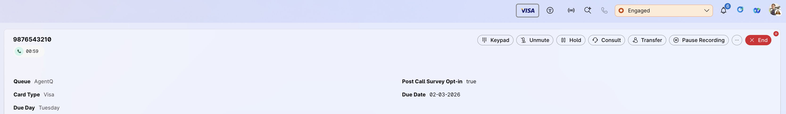

## Desktop Widget
## Visual Queue Identification - Display Custom Badges for Interactions

This widget displays custom badges/images based on Call Associated Data (CAD) variables, providing visual identification of interaction attributes. Perfect for showing customer tier badges, priority indicators, queue types, or any visual classification based on interaction metadata.

The widget dynamically generates image elements based on configured CAD variables, automatically showing/hiding badges as agents select different interactions. Supports multiple badges simultaneously for comprehensive visual context.

## Features

- Dynamic badge display based on CAD variables
- Multiple badges simultaneously supported
- Automatic show/hide on interaction selection
- Custom image URLs per CAD variable
- Error handling for missing images
- Lightweight and responsive design
- Flexible positioning in Desktop layout
- No interaction required - automatic display

### Widget UI



## How It Works

The widget monitors the selected interaction (via `taskid` attribute) and automatically:

1. Reads CAD variable values from the interaction
2. Constructs image URLs by combining base URL + CAD value
3. Displays badges in the configured location
4. Hides badges when interaction is deselected or ends

**Dynamic Configuration:**
- `cadVariable0`, `cadVariable1`, etc. - Names of CAD variables to read. These variables need to be defined in the flow (as flow variables), and marked as Desktop Viewable. It is not necessary that these be added to the Desktop View (but should definitely be marked as Desktop viewable).
- `badgeUrl0`, `badgeUrl1`, etc. - Base URLs for badge images

**Image URL Construction:**
```
Final URL = badgeUrl + CAD_Variable_Value
Example: "https://example.com/badges/" + "VIP.png" = "https://example.com/badges/VIP.png"
```

**Automatic Behavior:**
- Shows badges when interaction is selected
- Hides badges when no interaction is active
- Handles multiple badges independently

## Try this widget from local env

How to run the widget:

**Step 1:**

_To use this widget, we can run it from localhost_

- Inside this project on your terminal type: `npm install`
- Then inside this project on your terminal type: `npm run dev`
- This should run the app on your localhost:3001

**Step 2:**

_Add the widget to desktop layout:_

- Upload badge images to a web server (must be accessible via HTTPS)
- Ensure image filenames match the CAD variable values
- Sign in to Agent Desktop - badges appear automatically when handling interactions

_Manually update the agent team layout_

- Copy the below code to the `area` section of desktop layout.
- Update the `script` URL to point to your hosted widget file.
- Configure `cadVariable` and `badgeUrl` properties for your badges.
- Typically placed in `horizontal` or `vertical` areas for visibility.

**Basic Configuration (Single Badge):**
```json
{
  "comp": "desktop-vis-queue",
  "script": "http://localhost:3001/build/desktop-vis-queue.js",
  "attributes": {
    "taskid": "$STORE.agentContact.selectedTaskId"
  },
  "properties": {
    "taskType": "$STORE.agentContact.isMediaTypeTelePhony",
    "cadVariable0": "CustomerTier",
    "badgeUrl0": "https://your-domain.com/badges/"
  }
}
```

**Advanced Configuration (Multiple Badges):**
```json
{
  "comp": "desktop-vis-queue",
  "script": "http://localhost:3001/build/desktop-vis-queue.js",
  "attributes": {
    "taskid": "$STORE.agentContact.selectedTaskId"
  },
  "properties": {
    "taskType": "$STORE.agentContact.isMediaTypeTelePhony",
    "cadVariable0": "CustomerTier",
    "badgeUrl0": "https://your-domain.com/badges/tier/",
    "cadVariable1": "Priority",
    "badgeUrl1": "https://your-domain.com/badges/priority/",
    "cadVariable2": "QueueType",
    "badgeUrl2": "https://your-domain.com/badges/queue/"
  }
}
```


## Widget Properties

| Property | Type | Required | Description |
|----------|------|----------|-------------|
| `cadVariable0`, `cadVariable1`, etc. | String | Yes | Name of the CAD variable containing the badge identifier |
| `badgeUrl0`, `badgeUrl1`, etc. | String | Yes | Base URL for badge images (should end with `/` or appropriate separator) |
| `taskid` | String | Auto | Interaction ID (automatically passed by Desktop Store) |
| `tasktype` | String | Auto | Media type filter (passed by Desktop Store) |

**Note**: You can configure any number of badges by incrementing the index (0, 1, 2, 3, etc.). Each `cadVariable{n}` must have a corresponding `badgeUrl{n}`.

## Image Requirements

**File Naming:**
- Image filename must exactly match the CAD variable value
- Example: If `CustomerTier` = "VIP", file should be named "VIP.png" or "VIP.jpg"
- Case-sensitive matching

**Image Hosting:**
- Images must be hosted on a web server accessible via HTTPS
- CORS headers must allow Desktop domain access
- Recommended formats: PNG, JPG, SVG
- Recommended size: 192x64px or smaller for optimal display

**URL Structure:**
```
badgeUrl + CADValue
"https://example.com/badges/" + "Gold.png"
= "https://example.com/badges/Gold.png"
```

**Supported Formats:**
- PNG (recommended for transparency)
- JPG/JPEG
- SVG (for scalable graphics)
- GIF (for animated badges)

## Configuration Guidelines

**CAD Variable Setup:**
- Create CAD variables in Webex Contact Center Control Hub
- Populate values via flow logic or external integrations
- Ensure consistent value naming across flows
- Document expected values for badge mapping

**Multiple Badges:**
- Badges display horizontally by default
- Consider layout space when adding multiple badges
- Test with maximum expected number of badges
- Use consistent badge sizes for aligned display

## Troubleshooting

**Badges Not Displaying:**
- Verify image URL is accessible (test in browser)
- Check CAD variable exists in interaction data
- Verify CAD variable value matches image filename exactly (case-sensitive)
- Check browser console for 404 errors or CORS issues

**Images Not Loading:**
- Check CORS headers on image server
- Verify image file exists at constructed URL
- Check network tab in browser DevTools for errors
- Test URL construction: badgeUrl + CADValue


## Improve the widget:

- You can modify the widget as required.
- To create a new compiled JS file, execute the command `npm run build` which will create the new compiled widget under `src/build/desktop-vis-queue.js`.
- You may rename this file, host it on your server of choice, and use host link under `script` in the layout.

## Useful Links - Supplemental Resources

[Desktop JS SDK Official Guide](https://developer.webex.com/webex-contact-center/docs/desktop)

[Create custom desktop layout](https://help.webex.com/en-us/article/ng08gqeb/Create-custom-desktop-layout)

[Desktop Widgets Live Demo](https://ciscodevnet.github.io/webex-contact-center-widget-starter/)

## Disclaimer

> This is a sample widget to demonstrate CAD variable updates using the Desktop SDK.
> This demo showcases the possibilities of Desktop SDK and helps to identify & implement use cases.
